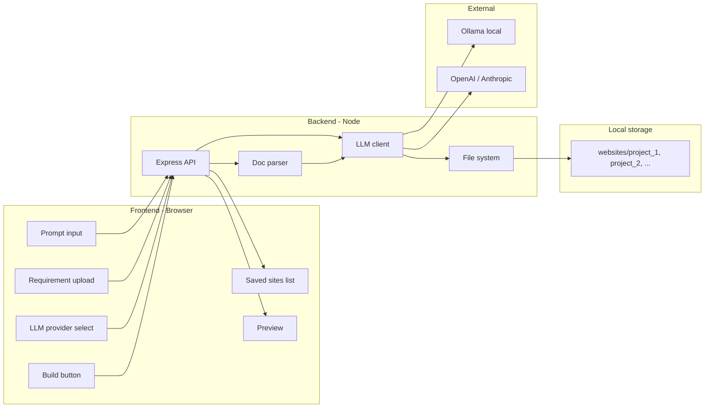

# Local Website Builder – Plan

## Goal

A single application you run locally (e.g. `npm run dev`), open in the browser, where you:

- Type a prompt describing the website
- Optionally upload requirement documents (PDF, DOCX, TXT)
- Choose LLM: **Ollama** (local) or **Cloud** (OpenAI / Anthropic)
- Click “Build” → app calls the LLM to generate HTML/CSS/JS
- Each build is saved as its own folder; you can list and open previous builds

Everything runs on your machine; only cloud APIs are used when you choose a cloud LLM.

---

## Architecture




- **Frontend**: React + Vite, single-page UI.
- **Backend**: Node.js (Express) for API, file handling, and LLM calls.
- **Storage**: One folder per build under e.g. `websites/` (or `projects/`), each with `index.html`, `styles.css`, `script.js`, and optional assets.

---

## Tech stack


| Layer     | Choice                                                    | Why                                               |
| --------- | --------------------------------------------------------- | ------------------------------------------------- |
| Frontend  | React 18 + Vite                                           | Fast, modern, simple to run locally.              |
| Backend   | Node.js + Express                                         | One language (JS), easy Ollama/HTTP and file I/O. |
| Styling   | Tailwind CSS                                              | Quick, consistent UI.                             |
| Doc parse | `pdf-parse`, `mammoth` (docx), `fs` (txt)                 | Extract text from uploads to send to LLM.         |
| LLM       | Ollama API (localhost:11434) + OpenAI SDK + Anthropic SDK | Local + cloud.                                    |


---

## Core features (mapped to your expectations)

1. **Prompt area** – Large textarea for “Describe the website you want.” Value sent to backend on Build.
2. **Requirement upload** – File input (PDF, DOCX, TXT). Backend parses to plain text and appends to the prompt/context sent to the LLM so the build “considers” the requirements.
3. **Save each build separately** – On each Build, backend creates e.g. `websites/build_<timestamp>_<shortId>/` and writes generated `index.html`, `styles.css`, `script.js` (and any assets the LLM describes) into that folder. Metadata (name, timestamp, prompt) can be stored in a small `meta.json` in the same folder.
4. **Runs locally** – Frontend: Vite dev server (e.g. port 5173). Backend: Express (e.g. port 3000). No deployment; you run both on localhost. Optional: single “start” script that runs backend + opens browser to frontend.
5. **LLM generates the website** – Backend builds a system prompt (e.g. “You are a website generator. Output only valid HTML/CSS/JS in the specified format.”) and sends user prompt + requirement text to the selected provider (Ollama or cloud). Response is parsed into HTML/CSS/JS and saved.
6. **“Package” / local app** – No installer. Delivered as a project you clone or copy: `npm install` then `npm run dev` (or one script that starts backend + frontend and opens the browser). All data stays in that project’s `websites/` (or similar) folder. Feels like a single local application.

---

## Suggested project structure

```
website-builder/
├── package.json          # Root: workspaces or single repo scripts
├── .env.example          # OPENAI_API_KEY, ANTHROPIC_API_KEY (optional)
├── README.md             # How to run + Ollama setup
├── client/               # Frontend (Vite + React)
│   ├── src/
│   │   ├── App.jsx
│   │   ├── components/
│   │   │   ├── PromptInput.jsx
│   │   │   ├── RequirementUpload.jsx
│   │   │   ├── ProviderSelect.jsx
│   │   │   ├── BuildButton.jsx
│   │   │   ├── SavedSitesList.jsx
│   │   │   └── PreviewFrame.jsx
│   │   └── main.jsx
│   └── vite.config.js
├── server/               # Backend (Express)
│   ├── index.js          # Express app, CORS, routes
│   ├── routes/
│   │   ├── build.js      # POST /build: prompt, files, provider
│   │   └── sites.js      # GET /sites (list), GET /sites/:id (meta + files)
│   ├── services/
│   │   ├── parser.js     # Parse PDF/DOCX/TXT to text
│   │   ├── llm.js        # Abstract Ollama vs OpenAI vs Anthropic
│   │   └── saver.js      # Create project folder, write HTML/CSS/JS
│   └── package.json
└── websites/             # Generated sites (gitignored or committed per preference)
    └── build_1738...
```

---

## Data flow

1. User selects **Ollama** or **Cloud** (and if cloud, which provider).
2. User types **prompt** and optionally **uploads** one or more requirement files.
3. User clicks **Build** → frontend sends `POST /build` with prompt, provider, and FormData (files).
4. Backend parses uploads to text, then calls LLM with:
  - System: “Generate a single-page website. Respond with three code blocks: one for HTML, one for CSS, one for JS.”
  - User: prompt + “Requirements from documents: …” + parsed text.
5. Backend parses LLM response (e.g. by `html /` css / ```javascript), creates a new folder under `websites/`, writes `index.html`, `styles.css`, `script.js`, and `meta.json`.
6. Backend returns `{ id, path, previewUrl }` to frontend.
7. Frontend updates **Saved sites list** and can open **Preview** in iframe or new tab (e.g. `GET /sites/:id/preview` or static serve from `websites/<id>/index.html`).

---

## LLM integration details

- **Ollama**: `POST http://localhost:11434/api/generate` (or chat endpoint) with model name (e.g. `llama3`, `codellama`). User must have Ollama installed and model pulled.
- **Cloud**: Use `openai` and `@anthropic-ai/sdk` (or fetch). Keys from `.env`; if missing, disable cloud options in UI and show a short setup note in README.
- **Structured output**: Prefer a single response with three clear code blocks (HTML, CSS, JS) and parse with regex or a simple state machine. Optionally support a JSON mode later (e.g. `{ "html": "...", "css": "...", "js": "..." }`) if the model supports it.

---

## Optional enhancements (later)

- **Rename / delete** saved sites from the list.
- **Edit** generated files in the app (simple code editor or link to open folder in VS Code).
- **Export** a site as a zip for sharing.
- **Templates**: “Start from template” (e.g. landing, blog) and then apply prompt + requirements.

---

## Deliverables

1. **Monorepo** (or single repo) with `client/` and `server/` runnable via `npm run dev` (and optionally one root script that starts both and opens the browser).
2. **README** with: prerequisites (Node, Ollama, optional API keys), `npm install`, `npm run dev`, and how to open the app in the browser.
3. **.env.example** listing `OPENAI_API_KEY`, `ANTHROPIC_API_KEY` for cloud; Ollama needs no key.
4. All builds stored under `websites/` (or equivalent) as separate folders; no database required.

This meets: prompt area, requirement upload, separate save per build, fully local execution, LLM-based generation (Ollama + cloud), and a “package” that is a locally saved application opening in the browser.